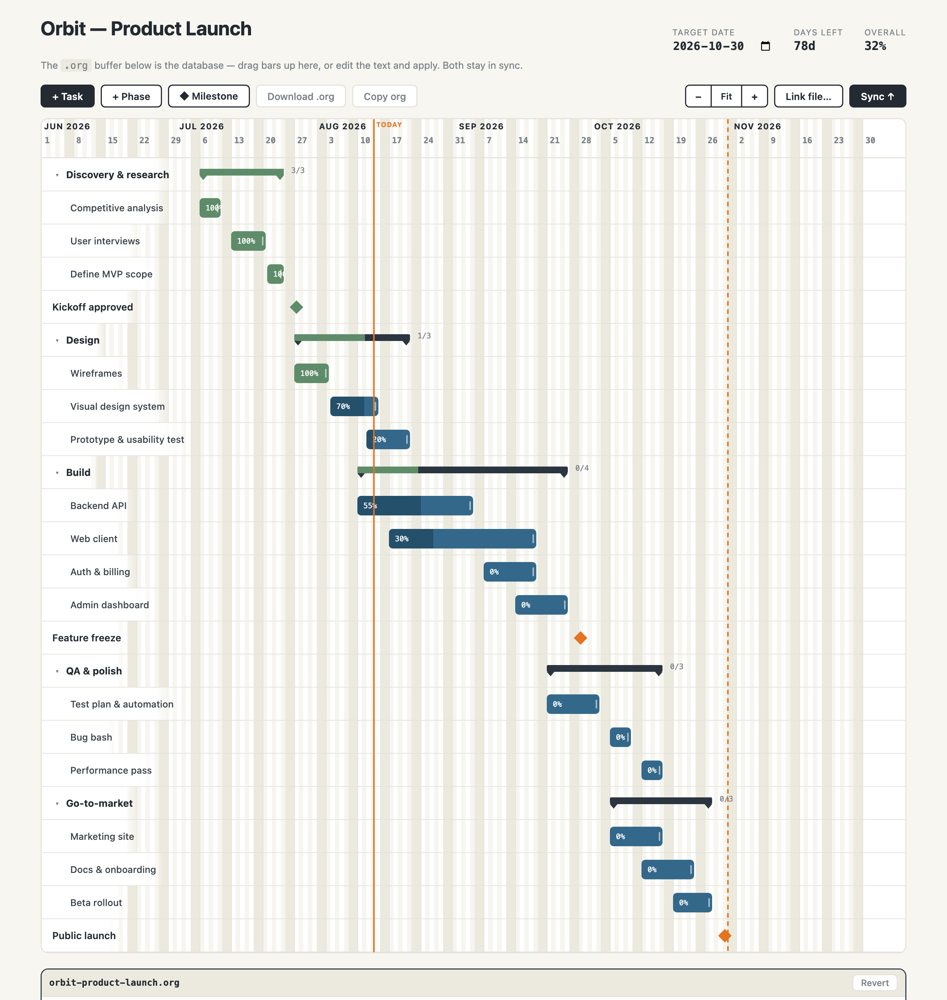

# org-gantt-web

> A web-based Gantt chart whose database is a plain [org-mode](https://orgmode.org/) file.



A single-file Gantt chart web app whose **native storage format is org-mode plain text**.
Built for solo project scheduling with one hard requirement: **data sovereignty**. The
`.org` file *is* the database, not an export — it round-trips cleanly with Emacs
org-mode, so you can drag bars around in the browser and edit the same file in Emacs
(agenda, clocking, archiving all still work).

- **No lock-in.** Your plan is a text file you own, diff, grep, and back up like code.
- **No account, no cloud, no build step.** One HTML file, plus an optional ~250-line
  Python server that uses only the standard library.
- **Two editors, one file.** The browser and Emacs edit the exact same `.org`.

## Features

- **Drag to reschedule** — drag a bar left/right to move its dates (1-day steps); the
  change is written straight back to the `.org` file.
- **Drag to reorder** — drag a bar up/down to change task order (rewrites the heading
  order in the file). A single gesture: horizontal moves dates, vertical reorders.
- **Resize** — drag a bar's right edge to change its duration.
- **Phases** — any heading with sub-headings becomes a phase; its span, progress, and
  `[n/m]` completion cookie are **derived from its children**, so the chart and file
  can never disagree. Collapsible.
- **Milestones** — headings tagged `:milestone:`, drawn as diamonds, at any level.
- **Progress** — a `:PROGRESS:` property (0–100) per task; the keyword flips to `DONE`
  at 100%. Overall % is duration-weighted.
- **Zoom & scroll** — zoom in for detail or out for the big picture; the timeline
  spans one month before your earliest task to one month after your latest, and
  scrolls/swipes horizontally with task names pinned.
- **Editable org buffer** — the plain-text source sits under the chart; edit either
  one and they stay in sync.
- **Multiple projects** with a most-recent-first switcher (server mode).
- **Autosave to disk** (server mode), atomic writes, so Emacs never sees a half-written
  file.

## Quick start

### Recommended — local server (works in every browser)

Serve the app and point it at a folder of `.org` files (e.g. inside Dropbox):

```bash
python3 server.py --dir ~/Dropbox/gantt
```

Then open <http://localhost:8730>. Every `.org` file in that folder shows up in the
project switcher; edits autosave back to the file, and Emacs edits the same files.
Requires Python 3 — no packages to install. (`--dir` defaults to `./projects`.)

### Standalone — just the file

Open `org-gantt-web.html` directly (no server). Your working copy lives in
`localStorage`, and in Chromium browsers a **Link file… / Sync** flow writes to a real
`.org` on disk via the File System Access API. In browsers without that API
(Firefox/Safari, and Brave unless enabled) use **Download .org**; `localStorage` works
everywhere.

### Demo — public-safe preview

```bash
python3 server.py --demo
```

In-memory sample projects; all writes are no-ops and stay in the visitor's browser.
Nothing touches the host disk — intended for a public "try before you download" page.

## The org format

This mapping is the heart of the project. Any file the app writes stays readable by
stock Emacs, and any conforming file is re-importable by the app.

```org
#+TITLE: Orbit — Product Launch
#+TARGET_DATE: <2026-10-30 Fri>
#+TODO: TODO | DONE

* TODO Design [1/3]                       ← phase (has children): dates & progress derived
** DONE Wireframes
SCHEDULED: <2026-07-27 Mon> DEADLINE: <2026-08-03 Mon>
:PROPERTIES:
:PROGRESS: 100
:END:
** TODO Visual design system
SCHEDULED: <2026-08-04 Tue> DEADLINE: <2026-08-14 Fri>
:PROPERTIES:
:PROGRESS: 70
:END:

* TODO Feature freeze :milestone:         ← milestone: DEADLINE only, drawn as a diamond
DEADLINE: <2026-09-28 Mon>
```

Rules:

- **Task** — a heading with `SCHEDULED:` (bar start) and `DEADLINE:` (bar end).
- **Milestone** — a heading tagged `:milestone:` with a `DEADLINE:` only. Works at any level.
- **Phase** — any top-level heading that has child headings. Its span, progress, and
  `[n/m]` cookie are all derived from the children and are **never stored** on the phase
  heading, so the file and chart stay consistent.
- **Progress** — the `:PROGRESS:` property (0–100) on a leaf task. The keyword flips to
  `DONE` at 100%.
- Nesting is two levels by design (phases → tasks).

`parseOrg(serialize(state))` is lossless for every supported construct. Unknown org
content outside these constructs may be dropped on import (a documented limitation),
but a file is never corrupted into invalid org.

## Runtime modes

The frontend auto-detects its mode at boot via `GET /api/config`:

| Mode | How | Storage |
|------|-----|---------|
| **server** | `server.py --dir <folder>` | Real `.org` files on disk; autosaved |
| **demo** | `server.py --demo` | In-memory samples; edits stay in the browser |
| **standalone** | open the HTML with no server | `localStorage` + File System Access API |

## Browser support

Everything works in every modern browser via the local server. The **standalone**
File System Access sync path is Chromium-only (Chrome/Edge; Brave requires enabling the
File System Access API flag); elsewhere it falls back to Download .org.

## Project layout

- `org-gantt-web.html` — the entire frontend: vanilla JS, no dependencies, no build.
- `server.py` — optional local backend: Python 3 standard library only, a small REST
  API over real `.org` files.

## License

[GNU GPL v3](LICENSE).
